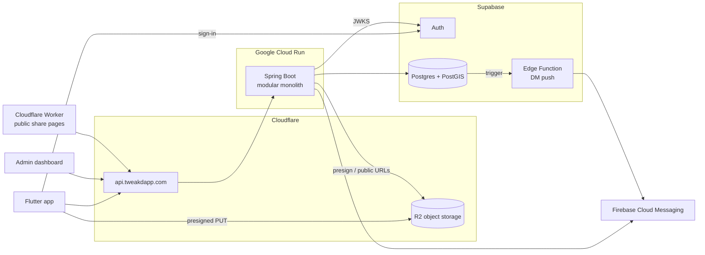

# Tweakd — Backend

The REST + WebSocket API behind **Tweakd**, a social network for car enthusiasts: share builds,
document every modification in a digital garage, find car meets on a live map, run contests,
chat, and discuss in forums.

This repository is the server side of a multi-repo product — a Flutter mobile app, a React admin
dashboard, a Cloudflare Worker for public share pages, and a marketing site all talk to it.


---

## At a glance

| | |
|---|---|
| **Architecture** | Modular monolith — 21 Spring Modulith modules with boundaries verified in CI |
| **API surface** | ~280 REST endpoints across 47 controllers, plus a STOMP WebSocket for realtime |
| **Codebase** | ~830 Java source files |
| **Tests** | 1,000+ tests — slice tests, and integration tests against a real PostGIS database via Testcontainers |
| **Clients** | Flutter (iOS / Android), React admin dashboard, Cloudflare Worker |
| **Runs on** | Google Cloud Run behind Cloudflare, Supabase Postgres, Cloudflare R2, Firebase Cloud Messaging |

---

## Features

**Social core**
- Profiles with onboarding, follows, blocking, and a global feed ranked by a time-decayed engagement score
- Posts with multi-image galleries, people and car tagging, likes, saves, comments, and reposts
- A **Tags** tab that merges every place a user or their cars were tagged into one chronological feed

**Garage**
- One garage per user, holding cars, a build log of modifications, and dream cars
- **Car sharing** — every car gets an immutable, typo-tolerant share code, rendered as a printable
  SVG QR sticker that opens the app (Universal / App Links) or a public web page

**Map & events**
- Business accounts (repair shops, detailers, tuners) and car meets as pins on a map, with
  **PostGIS radius search** and "open now" computed in the business's own timezone
- Event pages with organizers, car line-ups and attendees
- **Contests** with live leaderboards, podium finalisation, and medal badges

**Community**
- Forums with Reddit-style nested replies, sorting, and user-saved filter shortcuts
- A public feedback board where users vote on ideas and staff move them along a roadmap
- Reputation (an itemised ledger behind the score) and unlockable badges

**Realtime & notifications**
- 1:1 direct messages with typing indicators and read receipts
- Online / "active now" / last-seen presence over a shared STOMP WebSocket
- In-app notifications plus push delivery through Firebase Cloud Messaging

**Trust & safety**
- Content reporting, a moderation case queue, bans, and support tickets
- A staff dashboard API with role-based capabilities (owner, senior admin, content moderator, support agent, technical)

---

## Tech stack

| Layer | Technology |
|---|---|
| Language | Java 25 |
| Framework | Spring Boot 4, Spring MVC, Spring Security (OAuth2 resource server), Spring WebSocket (STOMP) |
| Architecture | Spring Modulith |
| Persistence | PostgreSQL on Supabase, JPA / Hibernate, Hibernate Spatial + PostGIS |
| Auth | Supabase Auth — JWTs validated against the issuer's JWKS |
| Storage | Cloudflare R2 (S3-compatible), presigned uploads via AWS SDK v2 |
| Push | Firebase Admin SDK (FCM); a Supabase Edge Function (TypeScript) for DM pushes |
| Rate limiting | Bucket4j + Caffeine |
| Testing | JUnit 5, Spring Boot test slices, Testcontainers (PostGIS), Spring Modulith test |
| Build & deploy | Maven, multi-stage Docker, Google Cloud Build → Cloud Run |
| Edge | Cloudflare (DNS, proxy, origin-secret header) |

---

## Architecture



### A modular monolith

The application is one deployable, split into **21 modules** with enforced boundaries. Each
top-level package under `com.tweakdapp.backend` is a Spring Modulith application module:

```
profile/              ← public API: service interface, DTOs, domain events, exceptions
└── internal/         ← private: controllers, service impl, entities, repositories
```

- Other modules may only import a module's **root package** — its service interface, DTOs, events
  and exceptions. Everything in `internal/` is private to the module.
- `ModularityTests` verifies the whole module graph on every test run, so an illegal dependency
  fails the build rather than slipping through review.
- Modules talk through service interfaces and **domain events** (e.g. a new follow, a liked post,
  an approved event), which keeps notifications, badges and reputation decoupled from the
  features that trigger them.
- `shared` is the one open module: security, realtime, the exception hierarchy, and rate limiting.

| Module | Responsibility |
|---|---|
| [`profile`](src/main/java/com/tweakdapp/backend/profile/README.md) | Profiles, onboarding, notification preferences, ban enforcement |
| [`relationships`](src/main/java/com/tweakdapp/backend/relationships/README.md) | Follows and blocks |
| [`garage`](src/main/java/com/tweakdapp/backend/garage/README.md) | Garages, cars, modifications, dream cars, car share links + QR codes |
| [`posts`](src/main/java/com/tweakdapp/backend/posts/README.md) | Posts, images, tagging, likes, saves, comments, reposts |
| [`feed`](src/main/java/com/tweakdapp/backend/feed/README.md) | Feed ranking and pagination (composes `posts`) |
| [`tags`](src/main/java/com/tweakdapp/backend/tags/README.md) | Merged "tagged in" feed across posts, forums and garage |
| [`forums`](src/main/java/com/tweakdapp/backend/forums/README.md) | Threads, nested replies, likes, saved shortcuts |
| [`business`](src/main/java/com/tweakdapp/backend/business/README.md) | Business accounts, map pins, opening hours |
| [`mapevents`](src/main/java/com/tweakdapp/backend/mapevents/README.md) | Car meets on the map, participation, contests and leaderboards |
| [`dms`](src/main/java/com/tweakdapp/backend/dms/README.md) | Direct messages, typing, read receipts |
| [`presence`](src/main/java/com/tweakdapp/backend/presence/README.md) | Online / last-seen status |
| [`notification`](src/main/java/com/tweakdapp/backend/notification/README.md) | In-app notifications and FCM push |
| [`reputation`](src/main/java/com/tweakdapp/backend/reputation/README.md) | Reputation ledger and score |
| [`badges`](src/main/java/com/tweakdapp/backend/badges/README.md) | Badge catalogue and event-driven unlocks |
| [`feedback`](src/main/java/com/tweakdapp/backend/feedback/README.md) / [`feedbackfeed`](src/main/java/com/tweakdapp/backend/feedbackfeed/README.md) | Feedback submissions and the public voting board |
| [`report`](src/main/java/com/tweakdapp/backend/report/README.md) | User reports on posts, comments, profiles and forum content |
| [`support`](src/main/java/com/tweakdapp/backend/support/README.md) | Support tickets |
| [`admin`](src/main/java/com/tweakdapp/backend/admin/README.md) | Staff dashboard: team, moderation, approvals, overview analytics |
| [`storage`](src/main/java/com/tweakdapp/backend/storage/README.md) | Presigned R2 uploads and public URL building |
| [`shared`](src/main/java/com/tweakdapp/backend/shared/README.md) | Security, realtime, rate limiting, errors, geo reference data |

Every module has its own README covering its endpoints, entities, events and database triggers.
[`CONTEXT.md`](CONTEXT.md) is the architecture deep-dive.

---

## Engineering highlights

A few decisions that shaped the codebase:

- **Guarantees live in the database.** Exactly-once rules — a badge awarded once, a reputation
  award counted once per source, a single dashboard owner — are partial unique indexes, not
  application-level checks. Callers can fire from retried event listeners without a guard of
  their own.
- **Concurrency-safe counters.** Reputation is moved under a pessimistic row lock that reports the
  before/after pair, so `previous + gain = new` holds on every ledger row even under concurrent
  awards. A database trigger was deliberately avoided because it could not provide that.
- **Keyset pagination everywhere.** Feeds, forums, events, notifications and DMs use opaque
  keyset cursors instead of `OFFSET`, so pages stay fast and stable as data is inserted.
- **No file bytes through the server.** Clients upload straight to R2 with presigned URLs; the
  database stores object keys and the backend builds public URLs at read time, so a CDN or bucket
  change is configuration, not a data migration.
- **Share codes built for print.** A car's share code may end up on a sticker, so it is random,
  immutable and Crockford-base32 (no `I L O U`). Lookups normalise ambiguous characters, and the
  QR is server-rendered SVG so a reprint years later is byte-identical.
- **Public endpoints use hand-written projections.** Anything under `/public/**` returns a
  purpose-built DTO, never one the app shares, so a new field is public only by deliberate choice.
- **Schema owned by migrations, verified by Hibernate.** Supabase SQL migrations own the schema
  and Hibernate runs in `validate` mode, so any drift between entities and tables fails at startup
  and in tests, not in production queries.

---

## Security

- **Stateless JWT auth.** Supabase-issued JWTs are validated as an OAuth2 resource server. Roles
  come from `app_metadata.role`, and `@PreAuthorize` method security is on.
- **Fine-grained staff capabilities.** `/api/v1/admin/**` requires the admin role, then each action
  checks a team-role capability. Staff accounts are separate auth users with no app profile.
- **Origin guard.** The API sits behind Cloudflare, which adds a shared-secret header. Requests
  arriving without it — e.g. straight to the Cloud Run URL — are rejected.
- **Rate limiting.** Per-user token buckets (per-IP on public routes): one general limit on every
  request plus named limits on writes such as posts, comments, reactions, reports and uploads.
  Over-limit requests get `429` with `Retry-After`. Limits are configuration, and the mode can be
  switched between `ENFORCE`, `LOG_ONLY` and `OFF` with no redeploy.
- **Ban enforcement** on every authenticated request, WebSocket auth on the STOMP `CONNECT` frame,
  device push tokens that are never returned by any endpoint, and Row Level Security on the
  database for direct client access.
- **Hardened container.** Multi-stage build, JRE-only runtime image, non-root user.

---

## Testing

```bash
./mvnw test
```

- **Integration tests** run against a real **PostGIS** database in Testcontainers, built from a
  dump of the production schema (`scripts/dump-schema.sh`). Because Hibernate validates the schema
  at boot, the suite also proves every entity matches the real database. Tests never touch the
  live database.
- **Web slice tests** (`@WebMvcTest`) cover controllers, validation, security rules and error
  shapes with fabricated JWTs.
- **`ModularityTests`** verifies module boundaries.

Docker must be running for the integration tests.

---

## Getting started

### Prerequisites

- Java 25 (the Maven wrapper handles Maven)
- Docker (for tests)
- A Supabase project, a Cloudflare R2 account, and optionally a Mapbox token and Firebase project

### Configuration

All non-secret configuration is in [`src/main/resources/application.yaml`](src/main/resources/application.yaml).
Secrets are read from environment variables, or from a `.env` file at the project root:

```properties
# Database (Supabase Postgres)
SUPABASE_DB_URL=jdbc:postgresql://<host>:5432/postgres
SUPABASE_USER=<user>
SUPABASE_DB_PASSWORD=<password>

# Supabase Auth + admin API
SUPABASE_URL=https://<project-ref>.supabase.co
SUPABASE_SECRET_KEY=<service-role key>

# Cloudflare R2
CLOUDFLARE_ACCOUNT_ID=<account id>
CLOUDFLARE_ACCESS_KEY_ID=<key id>
CLOUDFLARE_ACCESS_KEY_SECRET=<secret>
CLOUDFLARE_<GARAGE|POSTS|AVATARS|BUSINESS|MAP_EVENTS|ASSETS>_BUCKET_NAME=<bucket>
CLOUDFLARE_<GARAGE|POSTS|AVATARS|BUSINESS|MAP_EVENTS|ASSETS>_BUCKET_URL=<public url>

# Optional
MAPBOX_ACCESS_TOKEN=<token>
FIREBASE_PROJECT_ID=<project id>
RATE_LIMIT_MODE=OFF          # ENFORCE | LOG_ONLY | OFF
```

`.env` is git-ignored.

### Run

```bash
./mvnw spring-boot:run        # http://localhost:8080
```

or with Docker:

```bash
docker compose up --build
```

### Useful commands

```bash
./mvnw clean package                                          # build the jar
./mvnw test -Dtest=ProfileControllerTest                      # one test class
./mvnw test -Dtest=ModularityTests#verifiesModularStructure   # module boundaries only
./scripts/dump-schema.sh                                      # refresh the test schema from Supabase
```

---

## Deployment

Deploys are built by **Google Cloud Build** ([`cloudbuild.yaml`](cloudbuild.yaml)): a multi-stage
Docker image is pushed to Artifact Registry and rolled out to **Cloud Run** (`europe-west1`).
The service is served as `api.tweakdapp.com` through Cloudflare. Database changes ship as
Supabase SQL migrations in [`supabase/migrations`](supabase/migrations).

---

## Project layout

```
├── src/main/java/com/tweakdapp/backend/   # one package per module (see table above)
├── src/main/resources/application.yaml    # non-secret configuration
├── src/test/                               # unit, slice and Testcontainers integration tests
│   └── resources/db/                       # schema dump + seed data for integration tests
├── supabase/
│   ├── migrations/                         # SQL migrations (schema owned here)
│   └── functions/dm-push/                  # Edge Function for DM push notifications
├── scripts/dump-schema.sh                  # regenerates the test schema from the live database
├── Dockerfile · docker-compose.yml · cloudbuild.yaml
└── CONTEXT.md                              # architecture deep-dive
```

---

## Author

Built by **David Andrei Mesaros** — [GitHub @1Divy1](https://github.com/1Divy1).
